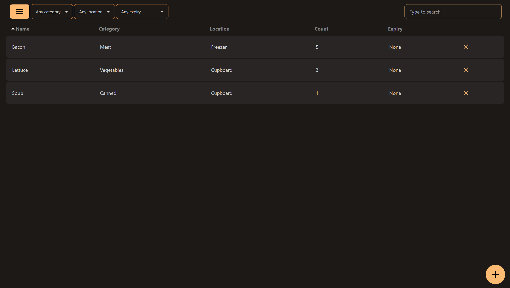

# Food Manager

## About

I created this tool for my parents so they can keep track of all the food stuffs they have in their house as they always seemed to forget what they have and ended up buying lots of extra things. The idea was to have a self-hosted website they could access at any point from their tablets or computers to check for anything that's about to expire or if they need to buy anything extra.<br/><br/>
The whole UI was designed to be simple to use and clean, and accessible on large screens, as well as tablets. I have not implemented a proper view for mobile as this wasn't a requirement they needed, but I welcome any pull requests to add this.<br/>
<br/>
This project is built using SvelteKit and Prisma (using Sqlite). 

## Setup

Run `npm i` first

To initialize the database, run:
`npm run init-db`

To view a development preview, run `npm run dev`

To build a production deployment, run `npm run build`

## Screenshots



## Deploying to Pi

### Prerequisites
- The Pi OS has to be 64 bit
- Install `nodejs` version `v18.18` using `nvm`

### Building

1. Delete the `.sveltekit` and `build` directories in the project2
2. `npm run build`
3. Copy over the `build` directory, `package.json`, and `package-lock.json` over to the Pi
4. Run `npm i --production` on the Pi
5. Move over the `prisma` directory _inside_ the `build` directory on the Pi
   1. Example path: `app/build/prisma`
6. Run `npx prisma generate --schema build/prisma/schema.prisma`
7. Now it's ready to run with `node build`

### Running on Another Port
The `ORIGIN` and `PORT` environment variables can be used to change the port it runs on.
For example, using port `1234`:
```
ORIGIN=http://localhost:1234 PORT=1234 node build
```

Note that `localhost` can be swapped out for the `hostname.local` URL instead.
See [here](https://www.howtogeek.com/167190/how-and-why-to-assign-the-.local-domain-to-your-raspberry-pi/) for details on how to access the pi via the hostname up and running.

### Running on Port 80 in the Background
Firstly, `iptables` is required for this, so install if with `apt-get`.

The script to run the app in the background on port 80 is the following:
```Bash
#!/bin/sh
sudo iptables -A PREROUTING -t nat -i eth0 -p tcp --dport 80 -j REDIRECT --to-port 3000
ORIGIN=http://localhost/ PORT=3000 nohup node build &
```
